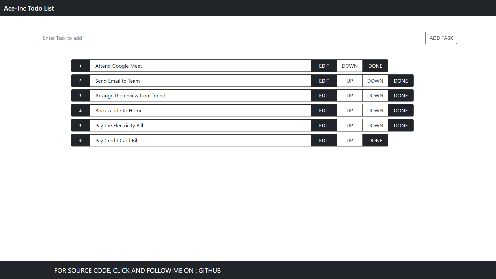
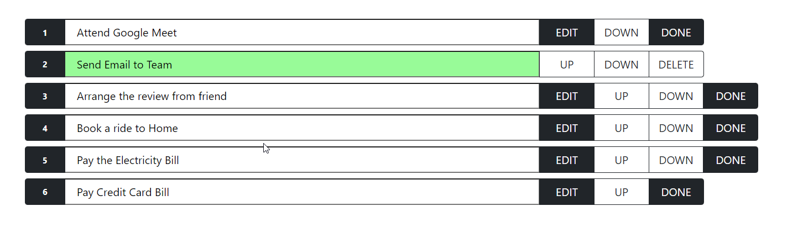
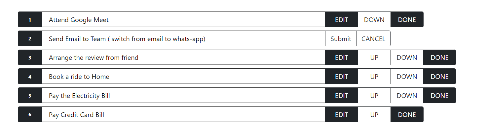
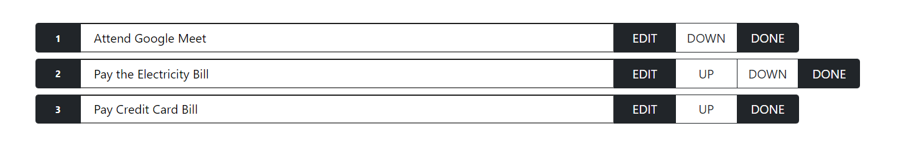

 # React - TodoList
(Please wait for screenshots to load thank you :) )

## Concepts and Learning

A React Todo-List that allows you to add Task, Edit and Mark it done, along with moving it up and down and positioning it.  
I have use useStates to manage multiple states, useEffect, customer styling and Bootstap 5 as it was a learning project rather that React Bootstrap.

### This Project is build using :  

React
Bootstrap 5  

Below are the screenshot for the project  

1 : Start Page.  

   

2 : Mark the Task done.  

  

3 : Edit the task.  

  

4 : Shuffling the task.  

  

Thanks for visiting.

